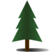

# Conifer Developer Manual

Conifer is a configuration framework for websites built on the GUS WDK
platform. This manual is for developers wishing to debug or extend
Conifer's functionality.

## Adding A New Cohort or Project

Using WDKTemplateSite as example, with its WDK project name as
`TemplateDB` and cohort name as `WDKTemplate`.

### Add template mapping file

The core GUS source code includes minimal templates for the WDK configuration.

```
WDK/Model/lib/conifer/roles/conifer/templates/WDK/model-config.xml.j2
WDK/Model/lib/conifer/roles/conifer/templates/WDK/model.prop.j2
```

If your website only uses the WDK and has no other applications that
need configuring, then the provided templates are all you need.

Your new web site project will have a directory of source code specific
for your implementation of WDK model and website UI. For this manual's
example, that directory is named
[`WDKTemplateSite`](https://cbilsvn.pmacs.upenn.edu/svn/gus/WDKTemplateSite/).
There is where you will put templates (if any) and vars files.

```
WDKTemplateSite/Model/lib/conifer/roles/conifer/templates/[optional.conf.j2]

WDKTemplateSite/Model/lib/conifer/roles/conifer/vars/WDKTemplate/templates.yml
```

The WDKTemplateSite only needs the templates provided by the WDK so this
directory is empty. You could even omit the empty directory entirely.

The `templates.yml` file encodes a YAML dictionary. Each configuration
file managed by Conifer for this cohort is listed with a `src` key for
the path to the Jinja2 template, relative to the `templates` directory,
and a `dest` key with the full path to the rendered configuration file.
The actual key value (e.g. `model-config.xml:`) for each entry can be
anything but must be unique within the dictionary and preferably the
same or similar as the configuration file name for readability. This
value is included in conifer's runtime stdout so that will be more
readable if you match with the filename.

```
model-config.xml:
  src: 'WDK/model-config.xml.j2'
  dest: '{{ gus_home }}/config/{{ project }}/model-config.xml'
model.prop:
  src: 'WDK/model.prop.j2'
  dest: '{{ gus_home }}/config/{{ project }}/model.prop'
```

_**Caution: A given cohort can use templates provided by another cohort
but each cohort needs its own `templates.yml` file.** Conifer does not
support the concept of stacking cohorts; there is only one in operation
at at time. It's just that configuration template files from other
cohorts happen to be installed where `templates.yml` can reference them
as `src` files. So, if you add a new template to, say WDK, you will need
to update the `template.yml` files in all your cohorts. Or not. This
design gives you the flexibilty for a given cohort to exclude
configuration templates that do not apply._

The conifer `install` subcommand needs to know what to install. That is
defined in the `install.yml` file in the cohort directory. For example,
`WDKTemplateSite/Model/lib/conifer/roles/conifer/vars/WDKTemplate/install.yml`

The yaml file lists dependency paths whose contents will be copied to
`$GUS_HOME/lib/`. Template macros are allowed.

Here is the `install.yml` for the `WDKTemplate` cohort of the
`TemplateDB` project which uses only the templates provided by the `WDK`.

```
dependencies:
  - '{{ project_home }}/WDK/Model/lib/conifer'
```

Here is another example from the `ApiCommon` cohort in the
`ApiCommonWebsite` project.

```
dependencies:
  - '{{ project_home }}/ApiCommonModel/Model/lib/conifer'
  - '{{ project_home }}/ApiCommonWebService/WSFPlugin/lib/conifer'
  - '{{ project_home }}/ApiCommonWebsite/Model/lib/conifer'
  - '{{ project_home }}/EbrcWebsiteCommon/Model/lib/conifer'
  - '{{ project_home }}/EbrcWebSvcCommon/WSFPlugin/lib/conifer'
  - '{{ project_home }}/WDK/Model/lib/conifer'
```

The core source for Conifer, `{{project_home}}/FgpUtil/Util/lib/conifer`,
and the cohort parent (aka a child of the cohort-root), e.g.
`{{project_home }}/ApiCommonWebsite/Model/lib/conifer`,
are automatically included so do not have to be explicitly listed.

If there are no dependencies, set the dependencies var to an empty array.

```
dependencies: []
```

### Add default configuration values

```
WDKTemplateSite/Model/lib/conifer/roles/conifer/vars/WDKTemplate/default.yml
```

Default values for templating variables are defined here, some/all of
which can be overridden as desired by other vars yaml files downstream
in the hierarchy. To make `conifer seed` usable, you should list *all*
required variables here and use the `=c=` comment marker for those that
have no default value and therefore must be defined later in the
hierarchy. Unfortunately there is not a good way to know what variables
are required other than to manually get the variables from the
configuration templates. As a starting point, you can grep the variables
out of all the templates; just be careful to note that some variables
are internal to conifer (used in comments) or may come from test
templates. Also some variables might not fit the regex used here (e.g.
`modelprop` in `model.prop.j2`).

```
find .  -name '*.j2' | xargs grep '{{' | sed  's/[^{]*{{ *\([^ |]*\).*/\1/'
```

### Add cohort-specific playbook
Optional. The stock `playbook.yml` provided by FgpUtil is usually sufficient, but
if you need a cohort specific playbook, say you would like to run some
post configuration tasks, create a playbook with the cohort name as a
prefix.

```
WDKTemplateSite/Model/lib/conifer/WDKTemplate_playbook.yml
```

## Coding Policies

### The Unbearable Flatness of Being

The definitions in the vars files generally have a flat structure,

```
modelconfig_appDb_connectionUrl: 'jdbc:...'
```

rather than a dictionary structure,

```
modelconfig:
  appDb:
    connectionUrl: 'jdbc:...'
```

Both are valid but the flat design was chosen to avoid recursive
overflows from interpolations referencing a variable in the same
dictionary. In the following example, `{{ modelconfig.oauthUrl }}` is an
illegal reference because it requires interpolating the `oauthUrl` value
from the same dictionary that is still being defined.

```
  modelconfig:
    oauthUrl: http://oauth.org
    profileUrl: '{{ modelconfig.oauthUrl }}'/user/profile
```

See https://github.com/ansible/ansible/issues/8603 for discussions on this topic.

We can get around this by flattening the assignments,

```
modelconfig_oauthUrl: http://oauth.org
modelconfig_profileUrl: '{{ modelconfig.oauthUrl }}'/user/profile
```

To be clear, a dictionary structure is allowed and we do use it in some
cases (`modelprop` is a primary example) but a flat structure has fewer
pitfalls.


## Conifer's special variable handling

The variables taken from the vars files are stored in the `conifer`
namespace by the `load_values.yml` task. Note that this is a branch of
the `vars` dictionary, e.g.

__I'm a bit unclear on Ansible's variable inventory. In these examples
where I refer to `vars`, it might actually be the
`vars.hostvars.localhost` branch that tasks are using. For brevity, I'll
just say `vars`.__

```
'{{ vars.conifer.modelconfig_appDb_connectionUrl }}'
```

The vars files include all the variables needed to populate templates.
The reason for partitioning these variables in the `conifer` namespace
dictionary is to facilitate finding and reporting variables that have
not been defined and so are candidates for the
`conifer_site_vars.seed.yml` file generated byt he `conifer seed`
command. The following goes into more detail.

At the upper levels of the hierarchy the variables may not have a value
assigned

```
connectionString:
```

or may have a conifer comment

```
connectionString: =c= This is the connection string
```

In both cases the `connectString` is considered defined when slurped up
by the YAML parser - having the Python value `None` in the first example
- and the templating engine will happily use those values, resulting in
configuration files generated without error but with unusable values,
such as

```xml
<modelConfig
  connectionString= None />
```

We don't want that so we delete these variables from the `conifer`
namespace dictionary used for templating. We use the `conifer_scrub()`
Jinja2 filter to do this, called from the `provision_templates.yml` task
file. The `conifer_scrub` filter is defined in `filter_plugins/core.py`.

Following this processing, variables not given values in the vars files
are truly undefined and the templating engine will error when they are
encountered.

## More about the `load_values` task

Conifer needs several bootstrapping values defined before it can run the
`configuration` subcommand. This includes `gus_home`, `project_home`,
`cohort`, et al.

When using filesystem naming conventions to derive bootstrapping values,
Conifer generates an Ansible command constructed like,

```
ANSIBLE_CONFIG=/var/www/ClinEpiDB/ce.mheiges/gus_home/lib/conifer/conifer.cfg ansible-playbook \
  -i localhost, \
  -e derived_project=ClinEpiDB \
  -e derived_cohort=ClinEpi \
  -e derived_gus_home=/var/www/ClinEpiDB/ce.mheiges/gus_home \
  -e site_vars=conifer_site_vars.yml \
  -e templates_config=ClinEpi/templates.yml \
  -e derived_hostname=mheiges.clinepidb.org \
  -e derived_webapp_ctx=ce.mheiges /var/www/ClinEpiDB/ce.mheiges/gus_home/lib/conifer/playbook.yml
```

The `-e` CLI args are Ansible extra vars that have highest precedence.
The `derived_*` variables are used so the precedence of extra variables
does not override variables we want set in the vars file hierarchy
(`conifer_site_vars.yml`, et al.). Let's look at the lifecycle of
`project` and its relationship to the extra vars `derived_project` as an
exemplar.

The `project` variable is used throughout configurations. It the
selector of the subdirectory in `gus_home/config` that the WDK uses to
locate configuration files (see the `model` parameter Tomcat deployment
descriptor file, e.g. `gus_home/config/toxo.b3.xml`) and is used by the
WDK `includeProjects`/`excludeProjects` flags in the WDK model.

In the simplest case, we can override the project derived from
file-naming conventions by passing `--project ToxoDB` to the CLI and be
done. The conifer executable sets both `derived_project` and `project`
as a highest-precedence Ansible extra vars.

Absent that, when using EBRC file-naming conventions to derive bootstrap
values, we want a way to override that self-discovery with values in
`conifer_site_vars.yml`.

The basic idea is that we initially copy the value of `derived_project`
to `project` and then optionally override that during the vars files
hierarchy traversal. Let's walk through the process to illustrate.

_Tip: When the `--debug` CLI option is used Conifer will log the state of
variables during the `load_values.yml` task to files in
`$GUS_HOME/lib/conifer/log/`. Use these to trace the progress of
variable overrides as the vars file hierarchy is traversed._


In the following walkthrough, we're looking at values under
`vars.hostvars.localhost` branch of Ansible's variables dictionary tree
but writing only `project` and `conifer.project` for brevity.

_Reminder, the `vars.hostvars.localhost` values are used for variables
in Ansible tasks. The `vars.hostvars.localhost.conifer` values are used
in the templates that Conifer provisions for configuration. So we need
to ensure that we keep both sets of variables in sync. This leads to a
bit of juggling of `include_vars` tasks in `load_values.yml` to manage
these two namespaces. Pay attention to the absence or presence of `name:
conifer` attribute in the `include_vars` tasks. This determines the
global or conifer namespace, respectively, where var values are being
assigned._

For this example, I used my website, `mheiges.clinepidb.org`, installed
at `/var/www/ClinEpiDB/ce.mheiges`. The `derived_project` is `ClinEpiDB`
(derived from the `/var/www/ClinEpiDB` path). But, I want to use `Gates`
for the project. In `conifer_site_vars.yml` I set `project: Gates`. For
this walkthrough, I am **not** setting the cohort in
`conifer_site_vars.yml`. I'm letting `cohort` default to the
`derived_cohort` extra vars set by the `conifer` executable, so I want
to follow that situation as well to further illustrate this process.

_Again, if you use `--project` on the CLI then that value takes highest
precedence per Ansible extra vars rules, so the following is not
relevant._

The `load_values.yml` task runs several tasks to include vars from
files. This is what we see happening as it runs through the hierarchy.

- "`load bootstrap values to global namespace`" assigns `derived_project`
to `project` and `derived_cohort` to `cohort`, so we then have
  - `project` is `ClinEpiDB`
    - this is not yet the desired `Gates` value.
  - `cohort` is `ClinEpi` as desired
  - `conifer.project` is undef
  - `conifer.cohort` is undef

- "`load user values to global namespace`" assigns/overrides with values
from `conifer_site_vars.yml`, so we then have
  - `project` is now Gates as desired.
  - `cohort` is `ClinEpi` as desired
  - `conifer.project` is undef.
  - `conifer.cohort` is `ClinEpi` as desired
  - This is now the desired `Gates` value.
  - This is important. The `project` (not `conifer.project`) value is
    used by `load cohort values`, et al. for `with_items: {{ project}}.yml`.
    This gives us the option for project-specific custom settings in
    `ClinEpiDB.yml` vs. `Gates.yml`.

- "`load default values`" assigns/overrides with values from `default.yml`, so we then have
  - `project` is still `Gates` as desired
  - `cohort` is `ClinEpi` as desired
  - `conifer.project` is now `=c= e.g. ToxoDB`
    - oops, our `Gates` value from `conifer_site_vars.yml` has been
    clobbered with the value from `default.yml`
      - _btw, this is a Conifer comment used by the `seed` subcommand,
      we don't want to 'fix' the clobbering by removing this from
      `default.yml`_
  - `conifer.cohort` is `=c= e.g. ...`
    - oops, our `ClinEp` value copied from `derived_cohort` in
    `bootstrap.yml` has been clobbered by the value from `default.yml`

- "`load cohort values`"
  - no change to `project` and `cohort`

- "`load environment values`"
  - no change to `project` and `cohort`

- "`load bootstrap values to conifer namespace`" assigns `derived_project`
    to `conifer.project` and `derived_cohort` to `conifer.cohort`, so we
    then have
  - `project` is still `Gates`
  - `cohort` is again `ClinEpi`
  - `conifer.project` is now `ClinEpiDB`
    - oops, this should have value `Gates` from `conifer_site_vars.yml`,
    we've clobbered this with the `derived_project` value with the
    `bootstrap.yml` task.
  - `conifer.cohort` is the desired `ClinEpi`

Finally,

- "`load user values to conifer namespace`" assigns/overrides with values
  from `conifer_site_vars.yml`, so we then have
  - `project` is `Gates` as desired.
  - `cohort` is `ClinEpi` as desired.
  - `conifer.project` is `Gates` as desired.
  - `conifer.cohort` is `ClinEpi` as desired.

Whew!


## Conifer seed

The uppermost `defaults.yml` serves two primary purposes. It first
provides default values that you wish to provision across your
organization (these can be overridden by later YAML files in the vars
hiearchy). Second, it delimits the **required** variables for your
organization. If a required variable does not have a default value (say,
a password) you should still include it here and set the YAML value to a
Conifer comment marker `=c=`.

```
password: =c= Your secret login credential
```

Any commented variables like this that are not overridden by later vars
files will be used by the conifer `seed` subcommand to generate a
site-specific vars starter file.

The `mk_site_vars.yml` task file uses the `conifer_pluck()` Jinja2
filter to collect these unset variables. The `conifer_pluck` filter is
defined in `filter_plugins/core.py`.

Only required settings for your organization should be included in the
`defaults.yml` file. Do not include optional settings, either undefined
or with a `=c=` marker because the conifer `seed` subcommand will report
in the site-specific vars starter file, implying to the end user that a
value is required.

### Variable naming conventions

`filename_property`

The string representing the file basename should be one word all lowercase.

Underscores '`_`' delimit configuration key hierarchy.

_The variable names used in the YAML vars files ultimately get used in
Jinja2 templates. The valid characters for variable names in Jinja2 are
the same as in Python 2.x: the uppercase and lowercase letters A through
Z, the underscore _ and, except for the first character, the digits 0
through 9._

For example,

```
<modelConfig>
  <appDb
    connectionUrl = {{ modelconfig_appDb_connectionUrl }}
    ...
  />
```

This is to help the user mentally map the yaml to the configuration
file. To keep variable names from growing to absurd lengths, you can
omit parts of the configuration hierarchy as long as it's unambiguous.
For example, in model-config.xml the `modelName` is a subkey under
`modelConfig` but since there's only one `modelName` in the file it's
reasonable to use the template variable `modelconfig_modelName` instead
of `modelconfig_modelConfig_modelName`. There are multiple
`connectionUrl` values so those need to be namespaced:

```
modelconfig_accountdb_connectionUrl
modelconfig_appDb_connectionUrl
modelconfig_userdb_connectionUrl
```

The most common user-defined variables are database credentials. As a
convenience to the user, you can create short-named, undefined variables
for these in `default.yml` that `conifer seed` will then pick up when
generating the seed file. For example, the `default.yml` file could look
like this.

```
appDb_connectionUrl: =c= e.g. jdbc:oracle:oci:@toxo-inc
appDb_login: =c= username for application database, e.g.
appDb_password: =c= password for application database

modelconfig_appDb_connectionUrl: '{{ appDb_connectionUrl }}'
modelconfig_appDb_login: '{{ appDb_login }}'
modelconfig_appDb_password: "{{ appDb_password }}"

```

This way, the user will be asked to define variables like `appDb_login`
rather than `modelconfig_appDb_login`. This is generally more clear to
the user and the user is not left wondering if `modelconfig_appDb_login`
is truly limited to the `model-config.xml` file or if the value is
actually reused in other configurations as one would hope. It does add
an extra level of indirection to follow when developing the
`default.yml` file so it's preferable to limit this strategy to the most
common user-defined variables.

Variable names not directly associated with a specific configuration
file, i.e. 'globals' that are interpolated into other variables, are prefixed with and underscore.

```
_topleveldomain: net
```

As with any coding best practices, the overall goal is to aid human
readers. There's no strict enforcement of these rules in the code.

### Secrets

Do not commit secrets to source control. Use lookups from system files or Vault (TBD).

### Enforce value consistency in vars yaml, not in templates.

Sometimes you need to ensure the same values are in multiple
configuration files. For example, the database connectionUrl in
profilesSimilarity-config.xml should be the same as the database
connectionUrl used in model-config.xml, so all subapplications are using
the same database. The preference in this situation is to have separate
variables for each configuration but use variable expansions in the vars
YAML file to ensure each has the same value.

For example, in vars yaml, we do

```
modelconfig.appDb.connectionUrl: 'jdbc:someconnstr'
profilesimilarityconfig_connectionUrl: '{{ modelconfig_appDb_connectionUrl }}'
```

These two variables will have the same value. In the template file for
`model-config.xml` we use

```
<appDb  connectionUrl="{{ modelconfig_appDb_connectionUrl }}" ... \>
```

and in the template file for `profilesSimilarity-config.xml` we use

```
<entry key="dbConnection">{{ profilesimilarityconfig_connectionUrl }}</entry>
```

This way, both configuration files get the same values by default
because they're defined the same in the vars files. In the hypothetical
case where you want to have different values, a given site can override
the default `profilesimilarityconfig_connectionUrl` value in the local
`conifer_site_vars.yml` file.

## YAML tips

The values `true`, `false`, `yes`, `no` are treated as booleans by the
YAML parser. Quote them if you want the literal strings used when
parsing templates. [improve this section with template input/output
examples]

```
key: 'yes'
```
## Merge behavior

The Ansible configuration file used with Conifer, `conifer.cfg`, sets
`hash_behaviour=merge`. This is required for several reasons, including:

- The `set_fact` to `copy global vars into conifer namespace` in the
`load_values.yml` task merges new vars into the `conifer` dictionary.

- The `include_vars` in `load_values.yml` puts values under the
`conifer` dictionary. The multiple calls to `include_vars` requires
merging the `conifer` dictionary.

### Backtracking from working files to source

All of Conifer working files are in `$GUS_HOME/lib/conifer` but
persistent changes need to be made in source files in `$PROJECT_HOME`.
The source files will be scattered within multiple subversion working
directories and so can be frustrating to associate an installed file
with its origin. As an aid to backtrack from the installed files to the
source we leverage Subversion keywords to print the origin file path as
a comment at the top of the file. We use a custom svn keyword (svn >=
1.8) to get the desired result.

Add a comment in the file with desired keyword(s).

```
# $SourceFileURL$
```

Then set the custom keyword property on the file.

```
svn propset svn:keywords "SourceFileURL=%P" default.yml
svn commit -m 'set svn:keywords'
```

The file will then include the source path. Note the path includes the
svn branch/trunk so it is not an exact match for the filesystem path;
this is a limitation of Subversion's custom keywords.

```
# $SourceFileURL: EbrcWebsiteCommon/branches/conifer/Model/lib/conifer/roles/conifer/vars/default.yml $
```

Refer to `svn help ps` for more information on custom keywords.

### Undesired Syslogging

Ansible's core `ansible.module_utils.basic` module includes logging to
journal/syslog. For example from `/var/log/messages`,

```
Nov 14 09:44:35 santol python: ansible-stat Invoked with checksum_algorithm=sha1 get_checksum=True path=/var/www/integrate.microsporidiadb.org/gus_home/config/highSpeedSnpSearch-config.xml checksum_algo=sha1 follow=False get_md5=False get_mime=True get_attributes=True
Nov 14 09:44:35 santol python: ansible-file Invoked with directory_mode=None force=False remote_src=None path=/var/www/integrate.microsporidiadb.org/gus_home/config/highSpeedSnpSearch-config.xml owner=None follow=True group=None unsafe_writes=None serole=None content=NOT_LOGGING_PARAMETER state=None diff_peek=None setype=None dest=/var/www/integrate.microsporidiadb.org/gus_home/config/highSpeedSnpSearch-config.xml selevel=None original_basename=highSpeedSnpSearch-config.xml.j2 regexp=None validate=None src=None seuser=None recurse=False delimiter=None mode=None attributes=None backup=yes
```

This is usually just noise to the system administrator but can not be
turned off in Ansible (as of 2.3.1.0) except using `no_log = True`,
however that also affects console logging. The only workaround I've
found is to exclude them via a rsyslog configuration. For example,
create `/etc/rsyslog.d/conifer.conf` with contents,

```
if $programname == "python" and $msg contains "ansible-" and $msg contains "gus_home" then stop
```

Related:
 - https://groups.google.com/forum/#!msg/ansible-project/ZA6Ua0PciKw/Mg1TqYRnbhUJ

### An example of backtracking from working files to source

A working Conifer installation in `GUS_HOME` is generated from source
files scattered about in `PROJECT_HOME`, a reflection of the design of
treating configuration as source code. This can make it a little
frustrating when detecting a bad runtime configuration and wanting to
patch the source file. As noted above, there are some hints included in
the files to help you backtrack from runtime to source. Here is an
example.


*The Problem:*

On my OrthoMCL site I noticed that the runtime configuration for
`WEBAPP_BASE_URL` in `model.prop` was not quite right.

```bash
[13:38 20170816 mheiges@luffa /var/www/OrthoMCL/orthomcl.msh/gus_home/config/OrthoMCL]
$ ack 'WEBAPP_BASE_URL'
model.prop
12:LEGACY_WEBAPP_BASE_URL=http://mheiges.orthomcl.org/orthomcl.msh///
18:WEBAPP_BASE_URL=http://mheiges.orthomcl.org/orthomcl.msh////app
```

That's too many slashes in the url! Let's fix that.

*The Backtracking:*

The runtime configuration file includes metadata at the top about its
origin. Viewing that with the `head` command,

```
$ head -n7 model.prop
# Templated by Conifer using
# /var/www/OrthoMCL/orthomcl.msh/gus_home/lib/conifer/roles/conifer/templates/WDK/model.prop.j2
# with vars from
# Cohort: OrthoMCL
# Project: OrthoMCL
# Environment:
# site_vars file: conifer_site_vars.yml
```

we see that the runtime configuration file came from
`$GUS_HOME/lib/conifer/roles/conifer/templates/WDK/model.prop.j2`

If we inspect `model.prop.j2` we'll see that the template loops over a
`modelprop` dictionary and prints out `{{ prop }}={{ value }}` pairs. So we need to find where
this website is getting its `modelprop` value, and specifically the `WEBAPP_BASE_URL` property.

Those values will be defined in a vars file so let's look in the
installed `var` directory in `GUS_HOME`,

```bash
$ cd $GUS_HOME/lib/conifer/roles/conifer/vars/
```

and search for `WEBAPP_BASE_URL`.

```
[13:58 20170816 mheiges@luffa /var/www/OrthoMCL/orthomcl.msh/gus_home/lib/conifer/roles/conifer/vars]
$ ack 'WEBAPP_BASE_URL'
OrthoMCL/default.yml
21:  LEGACY_WEBAPP_BASE_URL: '{{ modelconfig_webAppUrl }}'
27:  WEBAPP_BASE_URL: '{{ modelconfig_webAppUrl }}/app'

default.yml
122:  LEGACY_WEBAPP_BASE_URL: "{{ modelconfig_webAppUrl|regex_replace('/+$', '') }}"
123:  WEBAPP_BASE_URL: "{{ modelconfig_webAppUrl|regex_replace('/+$', '') }}/app"
```

We see these values are set in the organizational `default.yml` and then
overridden in the cohort `OrthoMCL/default.yml` file. The cohort
override doesn't strip trailing slashes as it should, so let's fix that.
Note that we've identified the problem in the installed files but we
need to fix this in the source code. The origin of this file can be
discovered from the metadata at the top of the YAML file.

```
[13:40 20170816 mheiges@luffa /var/www/OrthoMCL/orthomcl.msh/gus_home/lib/conifer/roles/conifer/vars]
$ head -n1 OrthoMCL/default.yml
# $SourceFileURL: OrthoMCLWebsite/trunk/Model/lib/conifer/roles/conifer/vars/OrthoMCL/default.yml $
```

_Note that the path includes the Subversion branch name which needs to
be removed before changing to that directory in project home. This is a
limitation of Subversion keywords being used. Also be aware that SVNKit
used by Jenkins for code checkout does not expand svn keywords so you
won't see this information on sites managed by Jenkins._

Now, we can navigate to the SCM directory

```bash
$ cd $PROJECT_HOME/OrthoMCLWebsite/Model/lib/conifer/roles/conifer/vars/OrthoMCL/
```

and edit `default.yml` to include the `regex()` filter to strip trailing
slashes.

```bash
$ svn diff default.yml
-  LEGACY_WEBAPP_BASE_URL: '{{ modelconfig_webAppUrl }}'
+  LEGACY_WEBAPP_BASE_URL: "{{ modelconfig_webAppUrl|regex_replace('/+$', '') }}"
-  WEBAPP_BASE_URL: '{{ modelconfig_webAppUrl }}/app'
+  WEBAPP_BASE_URL: "{{ modelconfig_webAppUrl|regex_replace('/+$', '') }}/app"
```

To be sure, install the fixes and run configure again.

```bash
$ conifer install mheiges.orthomcl.org
$ conifer configure mheiges.orthomcl.org
```

The model.prop is now correct. w00t!

```bash
$ ack 'WEBAPP_BASE_URL' $GUS_HOME/config/OrthoMCL/model.prop
LEGACY_WEBAPP_BASE_URL=http://mheiges.orthomcl.org/orthomcl.msh
WEBAPP_BASE_URL=http://mheiges.orthomcl.org/orthomcl.msh/app
```
Commit your changes.

```bash
$ svn commit -m 'strip trailing slashes from WEBAPP_BASE_URL in model.prop'
```


## ToDo

- self.component and self.cohort_root in the conifer script are probably
synonymous. If so, unify these.

